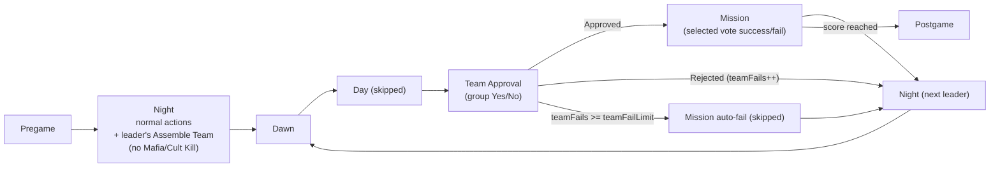

# Resistance-as-Mafia Trigger Role

## Architecture summary

A Mafia-aligned trigger role (working name `Spymaster`) binds a `MissionGame` card that:

- Flips a `game.ResistanceMode` flag on `roleAssigned`.
- Disables the Mafia faction `Kill` meeting (and the Cult `Kill` meeting if Cult is in play) while leaving the faction's `Meeting`/`Action` chat intact, so faction members can still coordinate at Night.
- Disables the Day `Village` meeting via the existing `NoVillageMeeting` pattern.
- Adds a Night-time `Assemble Team` meeting owned by the current leader (held via a new `MissionLeader` item), exactly replacing the slot the Mafia kill used to occupy.
- Adds two new Day-replacing states `Team Approval` and `Mission`, with team approval rejection / mission scoring / leader rotation logic ported from `Games/types/Resistance/`.

This matches the user direction: "Team selection happens at Night... other night functions remain the same except for the Mafia kill. The trigger role should be part of the Mafia team and replace their normal kill activity (follow the mafia Assassin role as a model)."




### Reusable patterns this leverages

- `extraStateCheck` + `shouldSkipState` from `AdmiralGame` - see [Games/types/Mafia/Game.js](Games/types/Mafia/Game.js) `shouldSkipState` and [Games/types/Mafia/roles/cards/AdmiralGame.js](Games/types/Mafia/roles/cards/AdmiralGame.js) `stateMods` / `extraStateCheck`.
- `NoVillageMeeting` item to suppress the Day vote, used by `ForceSplitDecision` - see [Games/types/Mafia/items/NoVillageMeeting.js](Games/types/Mafia/items/NoVillageMeeting.js).
- `WinWithFaction` conditional gating for new modes - see [Games/types/Mafia/roles/cards/WinWithFaction.js](Games/types/Mafia/roles/cards/WinWithFaction.js).
- Resistance leader/team/mission logic - port from [Games/types/Resistance/Game.js](Games/types/Resistance/Game.js), [Games/types/Resistance/items/Leader.js](Games/types/Resistance/items/Leader.js), and [Games/types/Resistance/roles/cards/TeamCore.js](Games/types/Resistance/roles/cards/TeamCore.js).
- Mafia Assassin trigger pattern - see [Games/types/Mafia/roles/Mafia/Assassin.js](Games/types/Mafia/roles/Mafia/Assassin.js) and [Games/types/Mafia/roles/cards/ForceSplitDecision.js](Games/types/Mafia/roles/cards/ForceSplitDecision.js).

## Confirmed design decisions

- **Alignment: Mafia.** Modeled on `Assassin`. Role lives at `Games/types/Mafia/roles/Mafia/Spymaster.js`.
- **Night phase: kept.** `Team Selection` is **not** a separate state - it is a Night-time meeting (`Assemble Team`) on the current leader, which slots in where the Mafia/Cult `Kill` meeting used to be.
- **Other night actions: preserved.** Cop investigates, Doctor protects, role-actions all run normally. Only the Mafia/Cult `Kill` meeting is disabled.
- **Mafia faction chat: preserved.** `Meeting` and `Action` from `MeetingFaction` continue to fire at Night so Mafia members can coordinate.
- **Leader rotation: every player.** Same as Resistance - leadership rotates through the entire player list (including Spymaster, villagers, etc). Rationale: shared agency forces spies to lead too, which is part of how their cover works. Easy to restrict if you want a different rule later.
- **Non-mapped roles: all allowed.** Doctor/Vigilante/Bomber/etc. keep their normal abilities; only the day-vote and the Mafia kill are replaced.
- **Resistance game type: kept for now**, deprecated in a follow-up PR after parity is verified.

## Backend changes

### 1. Trigger role + card

- **Role:** new `Games/types/Mafia/roles/Mafia/Spymaster.js` modeled on [Games/types/Mafia/roles/Mafia/Assassin.js](Games/types/Mafia/roles/Mafia/Assassin.js):
  ```js
  alignment: "Mafia";
  cards: ["VillageCore", "WinWithFaction", "MeetingFaction", "MissionGame"];
  ```
- **Card:** new `Games/types/Mafia/roles/cards/MissionGame.js`:
  - On `roleAssigned`: `this.game.ResistanceMode = true`; populate `numMissions`, `teamFailLimit`, `teamSizes`, randomized `leaderIndex`, `missionRecord`. Have every player `holdItem("NoVillageMeeting")` and `holdItem("NoMafiaKill")` so the Day vote and Mafia/Cult Kill meetings are suppressed.
  - `stateMods.Day` -> `shouldSkip: () => this.game.ResistanceMode`.
  - `extraStateCheck` registers `"Team Approval"` and `"Mission"` as extra states (mirrors how `AdmiralGame` registers `"Treasure Chest"`).
  - State listener (mission bookkeeping) handles transitions - see "State listener" task below.

### 2. New `MissionLeader` item

- `Games/types/Mafia/items/MissionLeader.js` - port of [Games/types/Resistance/items/Leader.js](Games/types/Resistance/items/Leader.js), but the `Assemble Team` meeting is registered with `states: ["Night"]` instead of `["Team Selection"]`. Action body remains the same: enable `Mission Success` for selected players, disable for everyone else, record `recordMissionTeam`, queue alert. Multi-min/max from `game.currentTeamSize`.

### 3. Disabling the Mafia/Cult kill: `NoMafiaKill` item

- New item `Games/types/Mafia/items/NoMafiaKill.js`. Pattern lifted from [Games/types/Mafia/items/NoVillageMeeting.js](Games/types/Mafia/items/NoVillageMeeting.js). `shouldDisableMeeting(name)` returns true for `"Mafia Kill"` and `"Cult Kill"` (or any `name.endsWith(" Kill")` faction-killing meeting). The faction `Meeting` (chat) and `Action` (end-meeting boolean) registered by [Games/types/Mafia/roles/cards/MeetingFaction.js](Games/types/Mafia/roles/cards/MeetingFaction.js) are explicitly **not** disabled.

### 4. Group / Team Approval / Mission Success meetings (in `MissionGame` card)

Mirror [Games/types/Resistance/roles/cards/TeamCore.js](Games/types/Resistance/roles/cards/TeamCore.js):

- `Group` chat in `["Night", "Team Approval", "Mission"]` - allows whole-table chat at Night so the leader can negotiate before assembling. (Resistance has it on `Team Selection`; using `Night` here is the analog.)
- `Approve Team` (boolean, `mustAct`, `includeNo`) in `["Team Approval"]`.
- `Mission Success` (boolean, `disabled` until selected by leader) in `["Mission"]`.

### 5. `Games/types/Mafia/Game.js` changes

In [Games/types/Mafia/Game.js](Games/types/Mafia/Game.js):

- Add the **two** new states (Team Selection is not a new state):

```js
{ name: "Team Approval", length: options.settings.stateLengths["Team Approval"] || 1000 * 60 },
{ name: "Mission", length: options.settings.stateLengths["Mission"] || 1000 * 60, skipChecks: [() => this.currentTeamFail] },
```

  Position them after `Day` in the array so the cycle becomes `... Night -> Dawn -> [Day skipped] -> Team Approval -> Mission -> Night ...`.

- Initialize Resistance fields in the constructor (only if useful; some can also live on the card to avoid polluting the base game): `ResistanceMode`, `mission`, `numMissions`, `currentMissionFails`, `teamFails`, `currentTeamFail`, `teamFailLimit`, `teamSizes`, `leaderIndex`, `missionRecord`.
- Add helper methods/getters: `currentTeamSize`, `currentLeader`, `recordMissionTeam`, `recordMissionFails` - direct ports from [Games/types/Resistance/Game.js](Games/types/Resistance/Game.js).
- Extend `shouldSkipState(state)`:
  - Skip `Day` when `ResistanceMode`.
  - Skip `Team Approval` and `Mission` when **not** `ResistanceMode`.
- Extend `getStateInfo` to set `name: "Mission ${this.mission}"` while in Mission state and to surface `extraInfo: this.missionRecord` while `ResistanceMode`, mirroring [Games/types/Resistance/Game.js](Games/types/Resistance/Game.js) `getStateInfo`.

### 6. State listener for mission bookkeeping

Inside `MissionGame` card, add a `state` listener (or override via `MafiaGame.incrementState` if cleaner):

- **Entering Night while ResistanceMode:** advance `leaderIndex` (wraparound), give `currentLeader` the `MissionLeader` item, queue alerts ("X is the leader. Team size: N").
- **Leaving Team Approval:** if `teamFails >= teamFailLimit`, queue alert "Mission failed due to lack of a team", `recordMissionFails(-1)`, advance `mission`, reset counters - matches `ResistanceGame.incrementState` lines 91-101.
- **Leaving Mission:** if `currentMissionFails > 0`, queue fail alert; otherwise queue success alert; `recordMissionFails`, advance `mission`, reset counters - matches lines 75-90.

### 7. Win conditions

In [Games/types/Mafia/roles/cards/WinWithFaction.js](Games/types/Mafia/roles/cards/WinWithFaction.js), add a ResistanceMode branch alongside the existing Assassin/Admiral conditionals:

- If `this.game.ResistanceMode`:
  - `Village` wins when `missionRecord.score.rebels >= ceil(numMissions / 2)`.
  - `Mafia` and `Cult` factions win when `missionRecord.score.spies >= ceil(numMissions / 2)`.
  - Suppress the standard faction-balance early returns so the mission score is the only victory path while in this mode.

### 8. Per-role tweaks (user's mapping)

Touch only roles whose behavior must change conditionally on `ResistanceMode`:

- **Seer** (`Merlin` equivalent) - on `start`, reveal evil-aligned players to Seer (port [Games/types/Resistance/roles/cards/Foresight.js](Games/types/Resistance/roles/cards/Foresight.js)). Mordred-equivalents (Godfather / Cultist (Respected)) are excluded by checking the existing `appearance.merlin === null` style flag, or by faction-tagging.
- **Templar** (`Tristan/Isolde` equivalent) - already has mutual-knowledge; user explicitly noted "does not have the guessing lose condition", so nothing extra needed.
- **Mafioso/Cultist (Lone)** (`Oberon` equivalent) - emerges naturally from a setup with a single Mafia/Cult role.
- **Godfather / Cultist (Respected)** (`Mordred` equivalent) - existing "appears as Village to Cop" already mirrors Mordred hiding from Merlin.
- **Morgana / Resistance-Assassin** - no Mafia equivalents per the user; not implemented.

### 9. Setup options + validation

Add a Spymaster-specific block to [routes/setup.js](routes/setup.js) `optionsChecks`, mirroring `optionsChecks.Resistance` (lines ~1536-1559): validates `firstTeamSize`, `lastTeamSize`, `numMissions`, `teamFailLimit`. Apply only when the trigger role is present in the setup.

### 10. `data/roles.js`

Add the new role entry with tags `["Setup Changes", "Mini-Game", "Resistance"]` and a `SpecialInteractions` block enumerating the user's role mapping. Tag the affected roles (`Seer`, `Templar`, `Godfather`, `Cultist (Respected)`) with `SpecialInteractions: { Spymaster: [...] }` so the role-builder UI surfaces the relationship.

## Frontend changes

### 1. Mission scoreboard inside Mafia

In [react_main/src/pages/Game/MafiaGame.jsx](react_main/src/pages/Game/MafiaGame.jsx), conditionally render the scoreboard panel ported from `ScoreKeeper`/`Score`/`MissionHistory` in [react_main/src/pages/Game/ResistanceGame.jsx](react_main/src/pages/Game/ResistanceGame.jsx). Visibility gate: `history.states[stateViewing]?.extraInfo?.missionRecord`.

### 2. State labels

Update Mafia state-label rendering in [react_main/src/pages/Game/Game.jsx](react_main/src/pages/Game/Game.jsx) to handle `Team Approval` and `Mission ${n}`. **No `Team Selection` label is needed** - it's just a Night meeting, which the existing voting/multi/mustAct UI already renders via `buildActionDescriptors`.

### 3. Setup builder

Expose `numMissions` / `firstTeamSize` / `lastTeamSize` / `teamFailLimit` inputs in the Mafia setup builder when the trigger role is added. Pattern lifted from [react_main/src/pages/Play/CreateSetup/CreateResistanceSetup.jsx](react_main/src/pages/Play/CreateSetup/CreateResistanceSetup.jsx).

## Tests

Add `test/Games/Mafia/Spymaster.test.js`:

- Trigger role activates `ResistanceMode` and disables both `Village` and `<Faction> Kill` meetings (but **not** faction `Meeting`/`Action`).
- Day is skipped; Team Approval and Mission run only when `ResistanceMode`.
- At Night, current leader has the `Assemble Team` meeting; non-leaders do not.
- Leader rotation cycles through all players and wraps.
- `Approve Team` rejection increments `teamFails`; reaching `teamFailLimit` auto-fails the mission and skips Mission state.
- Mission success/fail updates `missionRecord.score`.
- Win conditions: Village wins on rebel-score threshold, Mafia/Cult on spy-score threshold; standard faction-balance check is suppressed.
- Normal Night role actions (Cop investigate, Doctor protect) still fire.

## Resistance deprecation (follow-up PR, not this PR)

Once parity is verified:

- Delete `Games/types/Resistance/`.
- Delete `react_main/src/pages/Game/ResistanceGame.jsx`, `react_main/src/pages/Play/CreateSetup/CreateResistanceSetup.jsx`, `react_main/src/components/gameTypeHostForms/HostResistance.js`, `react_main/src/pages/Learn/gameTypes/LearnResistance.jsx`.
- Remove `"Resistance"` entries from [data/constants.js](data/constants.js) (`gameTypes`, `alignments`, `startStates`, state-length config) and from [data/roles.js](data/roles.js).
- Remove the Resistance branch in [routes/game.js](routes/game.js) and [routes/setup.js](routes/setup.js).
- Remove Resistance icon registration in [react_main/src/components/GameIcon.jsx](react_main/src/components/GameIcon.jsx) and game-type switches in `CreateSetup.jsx` and `HostGameDialogue.jsx`.

## Open design points worth deciding before code

1. **Trigger role name.** Suggested: `Spymaster` (Mafia). Avoids conflicting with both Mafia's `Assassin` and Resistance's `Assassin`. Other options: `Saboteur`, `Mastermind`, `Conspirator`. Pick one.
2. **Seer "guessing lose condition is on condemn" - what does "condemn" mean now?** There is no Day condemn vote in this mode. Two interpretations to choose from:
  - (a) Mafia/Cult win immediately if they Night-kill the Seer (closest analog: "condemned" = killed during the game).
  - (b) Add a one-shot Mafia/Cult "Guess Seer" Epilogue meeting (closer to Resistance's Assassin-guess).
3. **Should the trigger role itself act as the leader?** Default: leader rotates through all players (matches Resistance). Alternative: trigger role is always-leader, or never-leader.
4. **Team-size schedule.** Resistance uses linear interpolation between `firstTeamSize` and `lastTeamSize` over `numMissions`. Default to the same. Alternative: hardcoded by player count, or driven by `X-Shot`/`Delayed`-style modifiers like Mafia Assassin's `SpecialInteractionsModifiers`.

